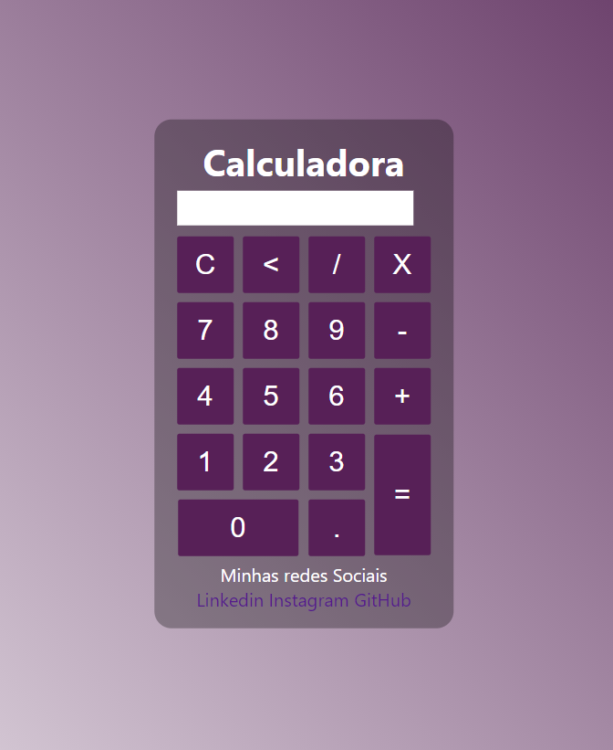

# projeto-calculadora-aritmetica

<h6><strong>Uma Calculadora feita com HTML,CSS e JavaScript aprendido com o Gustavo Neitzke: https://www.youtube.com/watch?v=42TShjXR0m0</strong></h6>

<a href="https://calculadora.deisecorreia.repl.co">Link</a>
